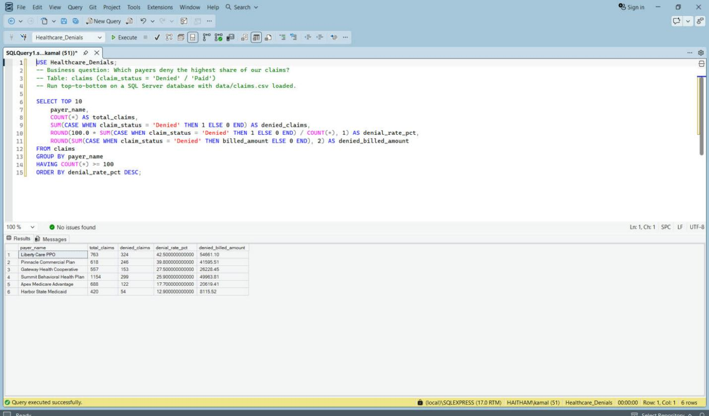
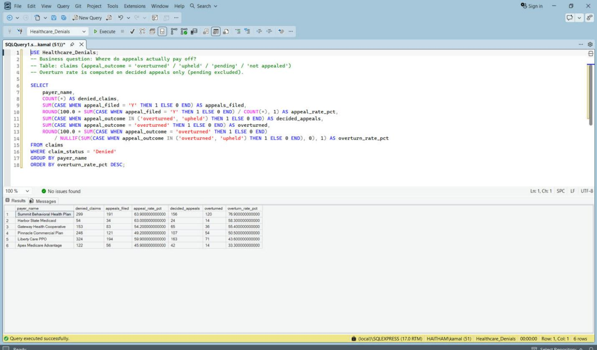
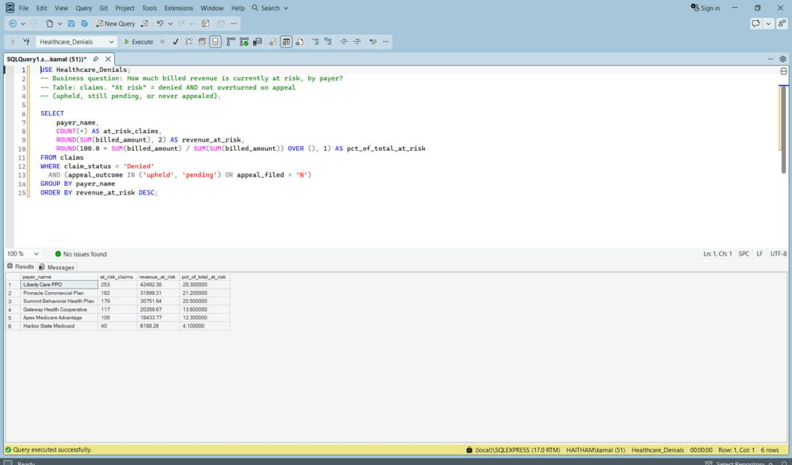

# Healthcare Denials Analytics

**Which payers deny, why, and where appeals pay off.** T-SQL (SQL Server) + Python + Power BI.

  

> **Data notice: every row is synthetic.** `data/claims.csv` is generated by `data/generate_synthetic_data.py`
> (seeded, reproducible). It is modeled on real behavioral-health revenue-cycle workflows, but no real patient, payer,
> provider, or employer data is used. All six payer names are fictional. CMS public files (DE-SynPUF) have no
> claim-level denial reasons, CARC codes, or appeal outcomes, so a labeled synthetic set is the honest choice.

## 1. Executive Summary & Business Context

Every denied claim is lost revenue until proven otherwise. A denials team has to answer: **which payer** denies us,
**why** (in CARC terms the billing team can act on), and **is the appeal worth the labor?**

Commercial relevance: denial rate, appeal overturn rate and days in AR are the core revenue-cycle KPIs. Small shifts in
them move cash flow directly, and they decide where billing staff time is best spent.

## 2. Data Architecture & Schema

- **Source:** one flat, claim-level table, `dbo.claims`, in database `Healthcare_Denials` (SQL Server Express), loaded
  from `data/claims.csv` with `BULK INSERT` ([`sql/00_setup_database.sql`](sql/00_setup_database.sql)). No joins: each
  row is one claim.
- **Data dictionary:** `claim_id, payer_name, cpt_code, diagnosis_code, billed_amount, claim_status, denial_reason,
  denial_date, appeal_filed, appeal_outcome, days_in_ar, service_date`
- **Scale:** 4,200 claims, 6 payers, 8 CPT codes, service dates 2025-01-06 to 2025-09-13.
- **Denial reasons:** CARC-style codes (CO-50, CO-96, CO-97, CO-29, ...).
- **Appeal outcomes:** overturned / upheld / pending / not appealed. Overturn rate uses decided appeals only.
- **Design note:** the flat table is deliberate. There are no eligibility, remittance or provider dimensions, so a star
  schema would add joins without adding information. The Power BI model reads the one table through Power Query.
- **Flow:** `generate_synthetic_data.py` -> `claims.csv` -> SQL Server `dbo.claims` -> T-SQL analysis + Power BI
  (Power Query -> DAX measures -> custom theme). Dashboard numbers reconcile to the SQL output.
  Definitions: [`reports/dax-measures.md`](reports/dax-measures.md).

## 3. Key Technical Implementations

### Python ([`data/generate_synthetic_data.py`](data/generate_synthetic_data.py))

- **Seeded generator** (standard library only: `csv`, `random`, `datetime`) that writes the claims file with a fixed
  seed, so every number in this repo is reproducible.
- **Weighted sampling** (`weighted_choice`) encodes distinct payer personalities: two aggressive deniers, one
  low-denier whose appeals rarely win, one where appeals almost always win.
- **Error validation** happens at load time: the verification query in `sql/00_setup_database.sql`
  (`sql/results/00_load_verification.png`) confirms 4,200 claims, 1,198 denied and $719,233 billed before any analysis runs.

### T-SQL ([`sql/`](sql/))

| Query | Business question |
|---|---|
| [`00_setup_database.sql`](sql/00_setup_database.sql) | Create database and table, `BULK INSERT`, load verification |
| [`01_denial_rate_by_payer.sql`](sql/01_denial_rate_by_payer.sql) | Which payers deny most? |
| [`02_denials_by_reason.sql`](sql/02_denials_by_reason.sql) | What drives denials (CARC)? |
| [`03_denial_rate_by_cpt.sql`](sql/03_denial_rate_by_cpt.sql) | Which services get denied? |
| [`04_appeal_overturn_rate_by_payer.sql`](sql/04_appeal_overturn_rate_by_payer.sql) | Where do appeals pay off? |
| [`05_days_in_ar_by_payer.sql`](sql/05_days_in_ar_by_payer.sql) | Who pays slowest? |
| [`06_revenue_at_risk.sql`](sql/06_revenue_at_risk.sql) | How much billed revenue is at risk? |

Techniques: conditional aggregation, `GROUP BY` drills by payer / reason / CPT, percentage-of-total calculations, and a
load-verification (reconciliation) script. Result screenshots are in [`sql/results/`](sql/results/).

### Power BI / DAX ([`reports/dax-measures.md`](reports/dax-measures.md))

- Power Query shapes `FactClaims`; measures live in `_Measures` (denial rate, overturn rate on decided appeals, revenue
  at risk, days in AR).
- **Page hierarchy:** 1. Denials Overview -> 2. Appeals & Revenue at Risk.

## 4. Visuals / Deliverables

**Page 1: Denials Overview.** Billed vs. denied dollars, denial rate, days in AR; denial rate by payer, denied dollars
by CARC code, monthly trend, payer slicer.

**Page 2: Appeals & Revenue at Risk.** $150,135 at risk across 889 claims, 55.5% overturn rate on decided appeals, payer
overturn table, CPT risk matrix (denial rate >= 30% highlighted), revenue at risk by payer.

**SQL result previews**

**Adding or refreshing exports:** save dashboard page captures into `reports/screenshots/` (or `docs/images/`, for
example `docs/images/dashboard_overview.png`), SSMS result captures into `sql/results/`, and reference them with
``.

Deliverable: [`healthcare-denials-dashboard.pbix`](healthcare-denials-dashboard.pbix).

## 5. Insights & Actionable Takeaways

Based on 4,200 claims, 1,198 denied (28.5%), $719,233 billed. The data is synthetic, so these demonstrate method.

1. **Two payers drive the problem.** Liberty Care PPO denies **42.5%** (324 of 763) and Pinnacle Commercial Plan
   **39.8%**; the other four sit between 12.9% and 27.5%. 58.3% of Liberty's denials are CO-50 (medical necessity),
   including **100% of its denied 60-minute sessions (CPT 90837, 66 of 66)**.
   *Action:* strengthen 90837 documentation or escalate with the payer.
2. **Pinnacle's problem is benefit design:** 48.0% of its denials are CO-96 non-covered charges.
   *Action:* verify benefits and obtain authorizations before service.
3. **Appeals pay, selectively.** Summit overturns **76.9%** of decided appeals; Apex only **33.3%**; blended 55.5%
   (309 of 557). *Action:* appeal everything at Summit, be selective at Apex.
4. **$150,135 of billed revenue is at risk** across 889 denied claims (Liberty alone: $42,492, 28.3%), and denied claims
   rot in AR: Liberty's average **86.6 days** vs 28.8 for paid claims, about 3x.
   *Action:* work denials inside the first weeks, before they age out.

## 6. Setup & Reproduction Guide

**Requirements:** Python 3 (no third-party packages), SQL Server Express + SSMS, Power BI Desktop (Windows).

1. **Clone:** `git clone https://github.com/Haitham1111/healthcare-denials-analytics.git`
2. **(Optional) regenerate the data:** `python data/generate_synthetic_data.py` (seed 42; reproduces `data/claims.csv`).
3. **Load SQL Server:** run [`sql/00_setup_database.sql`](sql/00_setup_database.sql) on `.\SQLEXPRESS`. It creates
   `Healthcare_Denials`, the `dbo.claims` table, and loads `data/claims.csv` with `BULK INSERT`. Edit the file path at
   the top if your copy lives elsewhere, and make sure the SQL Server service account can read it.
   Expect **4,200 claims, 1,198 denied**.
4. **Run the analysis:** run `sql/01` through `sql/06` against `Healthcare_Denials`.
5. **Open the dashboard:** open the `.pbix` in Power BI Desktop and click *Refresh*. If your server is not
   `.\SQLEXPRESS`, change it under *Transform data > Data source settings*.

## Next Steps with Real Data

- **Join eligibility data** to separate true CO-96 (benefit exclusion) from registration errors (wrong member ID,
  terminated coverage): different owners, different fixes.
- **Track denial-reason shifts per payer per month.** A 5-point jump in CO-50 from one payer is an early warning worth a
  same-week call to the provider rep.
- **Model appeal ROI per payer:** (overturn rate x average recovery) - (staff minutes x cost).
- **Add timely-filing deadline math** (CO-29) so no denial dies on a technicality.

## Limitations

- Synthetic data. Patterns (payer personalities, appeal win rates) are built in by the generator, so findings
  demonstrate method, not real-world payer behavior.
- Single flat table: no eligibility, remittance, or provider dimensions.
- Revenue at risk uses billed amounts, not expected or allowed amounts.
- Window is Jan-Sep 2025; days in AR for unresolved claims is measured to the day it was calculated.

## About

Built by **Haitham Saleh**, licensed Medicare insurance agent moving into healthcare data analytics. Two years managing
denied claims (denied department, 70+ payers) is the experience behind this project.
LinkedIn: https://www.linkedin.com/in/haitham-saleh-8a1a12206 | GitHub: https://github.com/Haitham1111
