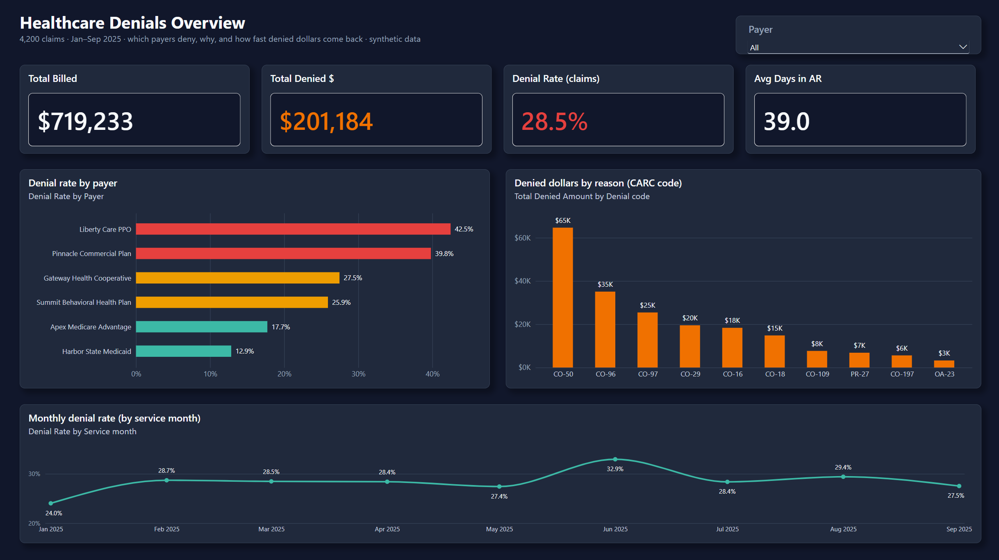
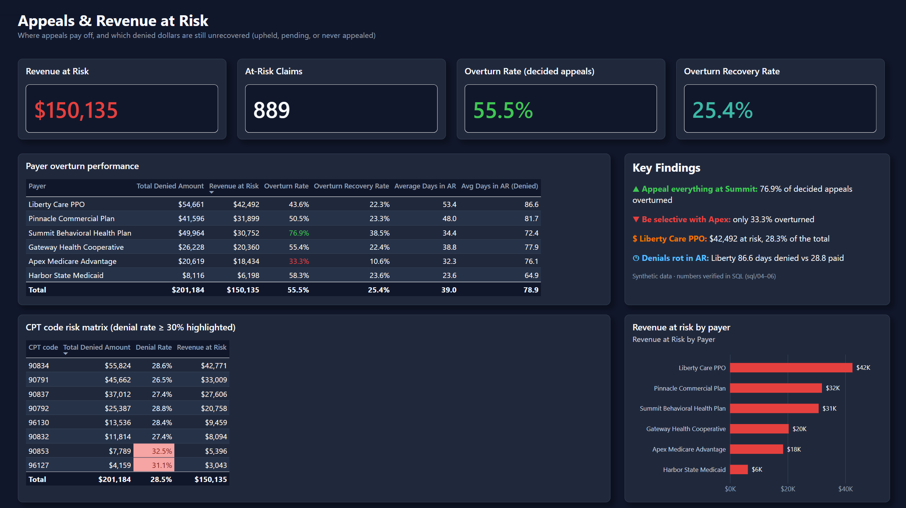

# Healthcare Denials Analytics

**Analyzing denied insurance claims: which payers deny, why, and where appeals pay off.**

> ### ⚠️ Data honesty notice
> **Every row in this project is synthetic.** The dataset (`data/claims.csv`) was
> generated by `data/generate_synthetic_data.py` (seeded, reproducible) and is
> modeled on real behavioral-health revenue-cycle workflows — but **no real
> patient, payer, provider, or employer data is used anywhere.** All six payer
> names are fictional. I researched real public alternatives first (CMS
> DE-SynPUF), but CMS's public files contain no claim-level denial reasons,
> CARC codes, or appeal outcomes, so they cannot answer denial-management
> questions. A labeled synthetic dataset is the honest choice here.

## Business problem

Denied claims are lost revenue. For a healthcare provider, every denial is a
three-part question: **which payer** is denying us, **why** (in CARC terms the
billing team can act on), and **is the appeal worth the labor cost?** This
project answers all three from claim-level data, the same way a denials team
would triage its backlog every Monday morning.

## Data

- **File:** `data/claims.csv` — 4,200 claims, 1,198 denied (28.5% denial rate)
- **Source:** 100% synthetic, generated in-repo (`data/generate_synthetic_data.py`, `random.seed(42)`)
- **Shape:** claim-level, one row per claim: `claim_id, payer_name, cpt_code,
  diagnosis_code, billed_amount, claim_status, denial_reason, denial_date,
  appeal_filed, appeal_outcome, days_in_ar, service_date`
- **Denial reasons** use realistic CARC-style codes (CO-50 medical necessity,
  CO-96 non-covered charges, CO-97 bundled, CO-29 timely filing, etc.)
- **Story baked into the data:** six fictional payers with distinct
  adjudication personalities — two aggressive deniers, one low-denier whose
  appeals rarely win, one payer where appeals almost always win.

## Method

1. Generated the synthetic claim file with per-payer denial/appeal/AR behavior.
2. Wrote six analysis queries in **SQL Server (T-SQL)** dialect (`sql/`), each
   answering one business question, and ran them in SSMS against a
   `Healthcare_Denials` database on SQL Server (screenshots in `sql/results/`).
3. Findings triaged the way a denials manager would: payer → reason → service
   line → appeal ROI → dollars at risk.
4. Built a two-page **Power BI** dashboard on the same database (Power Query →
   DAX measures → custom dark theme). Every dashboard number reconciles to the SQL output.

### Run it yourself (SQL Server / SSMS)

1. Run `sql/00_setup_database.sql` on `.\SQLEXPRESS`. It creates the `Healthcare_Denials`
   database, the `dbo.claims` table, and loads `data/claims.csv` with `BULK INSERT`
   (edit the file path at the top if your copy lives elsewhere). Expect 4,200 claims, 1,198 denied.
2. Run `sql/01` … `sql/06` top to bottom against `Healthcare_Denials`.

Every query has been run in SSMS against the loaded database. The result screenshots are
in [`sql/results/`](sql/results/):

| Query | Result |
|---|---|
| Load check — 4,200 claims, 1,198 denied, $719,233 billed | [`00_load_verification.png`](sql/results/00_load_verification.png) |
| 01 Denial rate by payer | [`01_denial_rate_by_payer.png`](sql/results/01_denial_rate_by_payer.png) |
| 02 Denials by reason (CARC) | [`02_denials_by_reason.png`](sql/results/02_denials_by_reason.png) |
| 03 Denial rate by CPT | [`03_denial_rate_by_cpt.png`](sql/results/03_denial_rate_by_cpt.png) |
| 04 Appeal overturn rate by payer | [`04_appeal_overturn_rate_by_payer.png`](sql/results/04_appeal_overturn_rate_by_payer.png) |
| 05 Days in AR by payer | [`05_days_in_ar_by_payer.png`](sql/results/05_days_in_ar_by_payer.png) |
| 06 Revenue at risk | [`06_revenue_at_risk.png`](sql/results/06_revenue_at_risk.png) |

## Key findings (all numbers from the queries in `sql/`)

1. **Two payers drive the denial problem.** Liberty Care PPO denies **42.5%**
   of claims (324 of 763); Pinnacle Commercial Plan denies **39.8%**. The
   other four payers sit between 12.9% and 27.5%. Denial management starts
   with Liberty and Pinnacle.
2. **Liberty's weapon is "not medically necessary."** 58.3% of Liberty's
   denials are **CO-50**, and **100% of its denied 60-minute therapy sessions
   (CPT 90837)** were coded CO-50. That's a clinical-documentation fight:
   the fix is stronger medical-necessity notes for 90837, or a payer
   escalation — not more appeals of the same shape.
3. **Pinnacle's problem is benefit design, not documentation.** 48.0% of its
   denials are **CO-96 non-covered charges**, concentrated in psychological
   testing (96127/96130). The fix is upstream: verify benefits and get
   authorizations *before* testing, because these denials are contractual.
4. **Appeals pay — but only where you pick your battles.** Summit Behavioral
   Health Plan overturns **76.9%** of decided appeals: appeal everything
   there. Apex Medicare Advantage overturns only **33.3%**: appeal selectively
   or not at all. Blended overturn rate is 55.5% (309 of 557 decided appeals).
5. **$150,135 in billed revenue is at risk right now** across 889 denied
   claims that were upheld, are still pending, or were never appealed.
   Liberty alone accounts for $42,492 (28.3% of the total).
6. **Denied claims rot in AR.** Liberty's denied claims average **86.6 days**
   in AR vs 28.8 for its paid claims — 3x slower. Every payer shows the same
   pattern: denials roughly triple days in AR.

## Dashboard (Power BI)

`healthcare-denials-dashboard.pbix` reads `dbo.claims` straight from SQL Server.
Two pages, dark theme, rule-based color coding (red = act now, amber = watch, teal/green = healthy).

**1. Denials Overview** — billed vs. denied dollars, claim denial rate, days in AR; denial
rate by payer (red above 35%), denied dollars by CARC code, monthly denial-rate trend, payer slicer.



**2. Appeals & At-Risk** — $150,135 revenue at risk across 889 claims, overturn rate on
decided appeals (55.5%), payer overturn table (green ≥ 60%, red < 40%), CPT risk matrix
(denial rate ≥ 30% highlighted), and revenue at risk by payer.



Measure definitions, the Power Query script, and how each one maps to the SQL are in
[`reports/dax-measures.md`](reports/dax-measures.md).

## What I'd do with real data

- **Join eligibility data** to separate true CO-96 (benefit exclusion) from
  registration errors (wrong member ID, terminated coverage) — different
  owners, different fixes.
- **Track denial reason *shifts* per payer per month** — payers change
  adjudication behavior silently; a 5-point jump in CO-50 from one payer is
  an early warning worth a same-week call to the provider rep.
- **Model appeal ROI per payer**: (overturn rate × average recovery) −
  (staff minutes × cost). Stop appealing payers below the line; reassign
  that labor to clean-claim submission.
- **Add timely-filing deadline math** (CO-29): every denial gets a
  days-remaining-to-file-appeal clock so nothing dies on a technicality.

## Repo layout

```
healthcare-denials-analytics/
├── README.md
├── healthcare-denials-dashboard.pbix   # Power BI dashboard (2 pages)
├── data/
│   ├── claims.csv                  # synthetic claim-level dataset (4,200 rows)
│   └── generate_synthetic_data.py  # the generator — rerun to reproduce
├── sql/
│   ├── 00_setup_database.sql       # create Healthcare_Denials + load claims.csv
│   ├── 01_denial_rate_by_payer.sql
│   ├── 02_denials_by_reason.sql
│   ├── 03_denial_rate_by_cpt.sql
│   ├── 04_appeal_overturn_rate_by_payer.sql
│   ├── 05_days_in_ar_by_payer.sql
│   ├── 06_revenue_at_risk.sql
│   └── results/                    # SSMS screenshots of every query's output
└── reports/
    ├── dax-measures.md             # Power Query + DAX measure definitions
    ├── denials-theme-dark.json     # custom report theme (light variant alongside)
    └── screenshots/                # 01_denials_overview.png, 02_appeals_and_at_risk.png
```

## About

Built by **Haitham Saleh** — licensed Medicare insurance agent moving into
healthcare data analytics. I managed denied claims for 2+ years (denied
department, 70+ payers), so this is the analytics I wish I'd had: SQL Server,
Power BI, DAX. Part of a portfolio applying revenue-cycle domain knowledge to
data.
